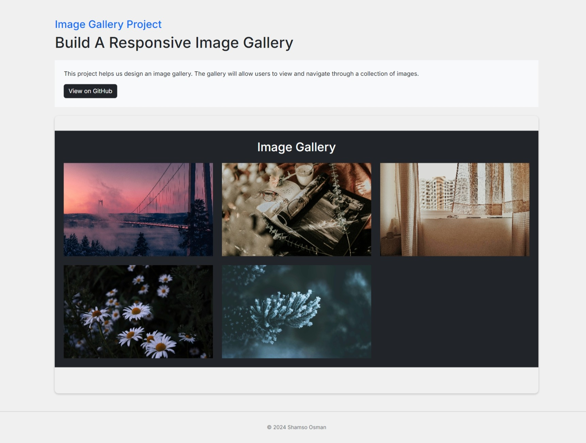

# Image Gallery Project

This project is a responsive image gallery that allows users to view and navigate through a collection of images. The gallery features a clean, modern design, using Bootstrap for layout and styling, and includes an interactive image slider. Each image in the gallery is accompanied by a caption and a link to the original source.

## Features

- **Responsive Design:** The gallery adapts seamlessly to different screen sizes, ensuring a smooth experience on desktops, tablets, and mobile devices.
- **Image Slider:** Users can click on any image to open a modal image slider, allowing them to navigate through the images with "Previous" and "Next" buttons.
- **Captions:** Each image has a caption that includes a description and credits to the original photographer, with links to the source.
- **Hover Effect:** The captions are revealed when the user hovers over the image, providing a sleek and interactive experience.
- **Footer:** The footer is styled consistently with the rest of the design, providing a professional finish.

## Technologies Used

- **HTML5**: For the structure of the page.
- **CSS3**: For styling, including custom styles for the gallery and captions.
- **Bootstrap 5**: For responsive layout, modal functionality, and additional styling.
- **JavaScript**: For handling the image slider functionality.

## Project Structure

- **index.html**: The main HTML file containing the structure of the image gallery.
- **styles.css**: Custom CSS styles for the gallery, captions, and hover effects.
- **src/script.js**: JavaScript file that manages the image slider functionality.
- **assets/**: Directory containing the image files used in the gallery.
- **demo/** : Directory containing demo img and video.

## Credits

- The images used in this project are credited to their respective photographers from Unsplash.

## License

This project is open-source and available under the [MIT License](LICENSE).
