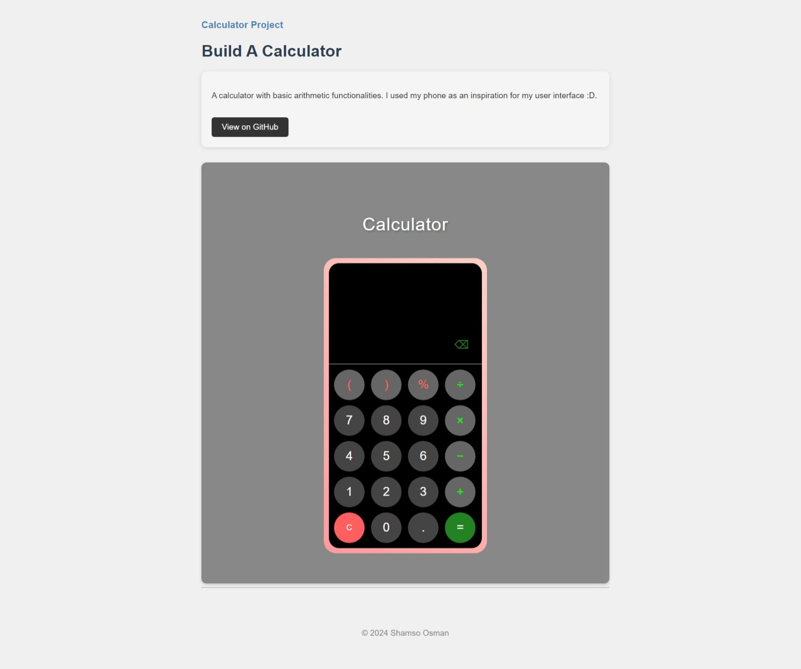

# Calculator Project

This project is a web-based calculator inspired by a mobile phone interface, offering basic arithmetic functionalities with a sleek, modern design.

## Features

- **Basic Arithmetic Operations:** Supports addition, subtraction, multiplication, division, and percentage calculations.
- **Responsive Design:** The calculator adapts to various screen sizes, ensuring a smooth user experience on desktops, tablets, and mobile devices.
- **User-Friendly Interface:** The layout is designed to resemble a mobile phone's calculator, with clearly labeled buttons and a clean, intuitive design.
- **Backspace Function:** Allows users to delete the last entered digit or operator for easy correction.
- **Error Handling:** Displays 'Error' for invalid operations or expressions.

## Technologies Used

- **HTML5**: For the structure of the page.
- **CSS3**: For styling the calculator, including custom buttons, hover effects, and layout design.
- **JavaScript**: For handling the calculator's logic, including arithmetic operations, display updates, and button interactions.

## Project Structure

- **index.html**: The main HTML file containing the structure of the calculator.
- **styles.css**: Custom CSS styles for the calculator, buttons, and layout.
- **src/script.js**: JavaScript file that manages the calculator's functionality and user interactions.
- **demo/** : Directory containing demo img and video.

## Credits

- Design inspired by my smartphone calculator app.

## License

This project is open-source and available under the [MIT License](LICENSE).
