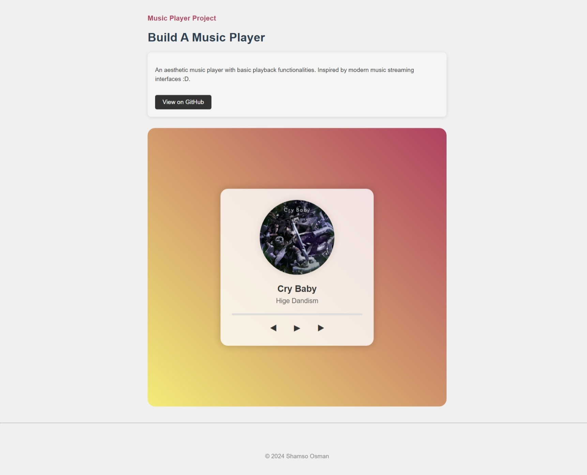

# Aesthetic Music Player

This project is a stylish music player with essential playback functionalities, designed with a modern aesthetic. It features a sleek interface, dynamic album cover display, and interactive controls, inspired by contemporary music streaming apps.

## Features

- **Responsive Design:** The player adapts to various screen sizes, ensuring usability across desktops, tablets, and mobile devices.
- **Dynamic Album Cover:** The album cover updates to reflect the currently playing song, enhancing the visual experience.
- **Playback Controls:** Includes buttons for play, pause, next, and previous, with intuitive icons and transitions.
- **Progress Bar:** Displays the current playback status and allows users to seek through the song.

## Technologies Used

- **HTML5**: For the structure of the music player and its components.
- **CSS3**: For styling, including custom design for the player, controls, and responsive adjustments.
- **JavaScript**: For handling music playback and progress updates

## Project Structure

- **index.html**: The main HTML file containing the layout and structure of the music player.
- **styles.css**: Custom CSS styles for the music player, including layout, colors, and responsive design.
- **src/script.js**: JavaScript file that handles music playback, controls, and playlist management.
- **assets/**: Directory containing music files and album cover images.
- **demo/** : Directory containing demo image

## Credits

- The music files and album covers used in this project are sourced from various online resources.

## License

This project is open-source and available under the [MIT License](LICENSE).
